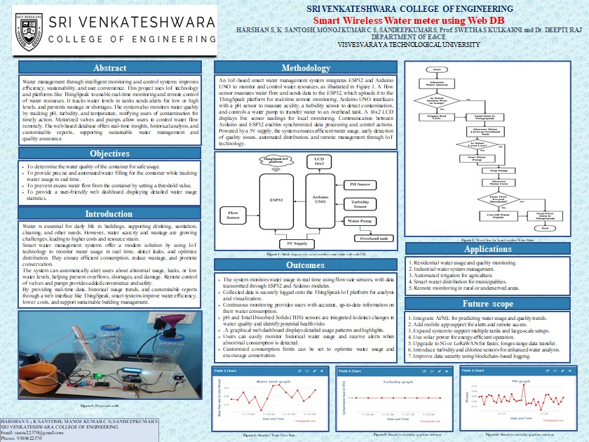
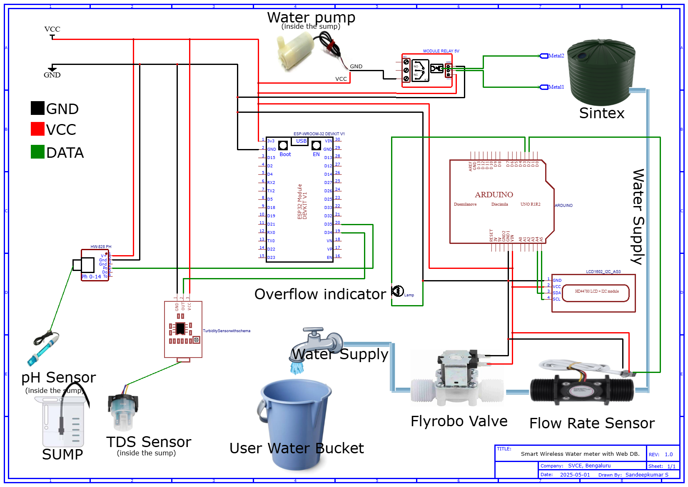
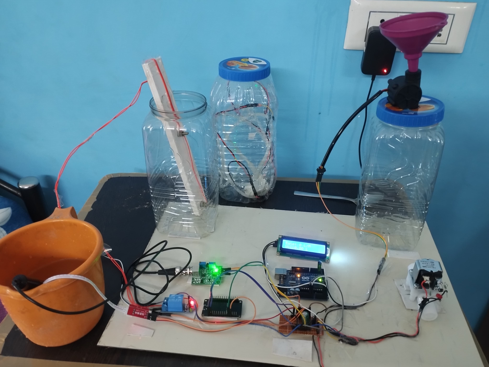
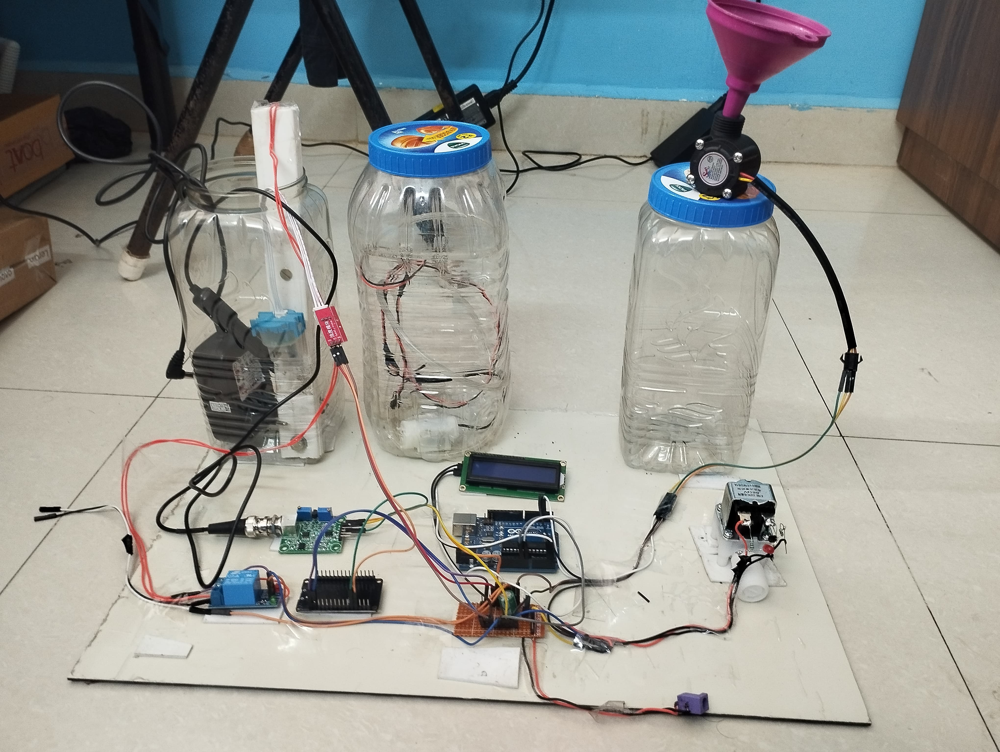

# 🚰 Smart Wireless Water Meter with Web Dashboard

A **Smart IoT-based Water Metering System** that enables real-time monitoring of water usage, ensures water quality, and supports automated pump control. Built using the **ESP32** and **Arduino UNO**, and integrated with the **[ThingSpeak IoT platform](https://thingspeak.mathworks.com/channels/2819273)**, this system enables remote access, live data visualization, and intelligent automation for water conservation.



---

## 🎯 Project Objectives

- Optimize water consumption through **smart metering**
- Monitor **flow rate**, **pH**, **TDS**, and **tank levels**
- Enable **automated water pump control**
- Provide **alerts and visualizations** via a web dashboard

---

## 📦 Features

- 📡 **Wireless Monitoring** using ESP32 & Wi-Fi
- 🌐 **ThingSpeak Dashboard** for real-time IoT analytics
- 🌊 **Flow Rate Measurement** with flow sensor
- 💧 **Water Quality Detection** via TDS & pH sensors
- 🔁 **Automated Pump Control** with Relay Module
- 🖥 **LCD Display** for local data output
- 🛠 **Reliable Dual MCU Setup** using ESP32 + Arduino UNO

---

## 🛠️ Tech Stack

| Component              | Description / Role                     |
|------------------------|----------------------------------------|
| **ESP32**              | Main microcontroller with Wi-Fi       |
| **Arduino UNO**        | Secondary controller for sensor interfacing |
| **pH Sensor**          | Measures water pH level               |
| **pH Amplifier**       | Amplifies pH sensor signal            |
| **TDS Module**         | Monitors total dissolved solids       |
| **Flow Rate Sensor**   | Measures water flow rate              |
| **Relay Module**       | Switches water pump on/off            |
| **Water Pump**         | Controls water supply                 |
| **LCD 16x2 Display**   | Displays real-time readings locally   |
| **Flyrobo**            | Supplier of components                |
| **Software**           | Arduino IDE, Embedded C               |
| **Cloud Platform**     | ThingSpeak IoT Platform               |

---

## 🧰 Prerequisites

- ESP32 Development Board
- Arduino UNO
- Flow Sensor
- TDS Sensor
- pH Sensor with Amplifier
- Relay Module
- Water Pump
- LCD 16x2 Display
- Jumper Wires, Breadboard, Power Supply
- Arduino IDE + ThingSpeak Account

---

## ⚙️ Hardware Setup



1. Connect all sensors to Arduino UNO and ESP32 accordingly.
2. Ensure correct voltage levels and power supply.

---

## 💻 Firmware Installation

1. Install **Arduino IDE** and add board support for ESP32.
2. Install libraries:
   ```cpp
   #include <WiFi.h>
   #include <ThingSpeak.h>
   #include <ArduinoJson.h>
3. Upload the respective firmware to:
   - ESP32: for Wi-Fi and ThingSpeak communication
   - Arduino UNO: for reading and preprocessing sensor data
4. Configure:
   - Wi-Fi credentials
   - ThingSpeak channel & API keys

---

## 🌐 ThingSpeak Setup

1. Create a new **[ThingSpeak Channel](https://thingspeak.mathworks.com/)**
2. Add the following fields:
   - Flow Rate
   - TDS Level
   - pH Level
3. Copy the Write API Key and use it in your ESP32 code.

---

## 🚀 System Workflow
1. The sensors gather real-time data via Arduino UNO and ESP32.
2. Data is sent to ESP32, which uploads it to ThingSpeak.
3. ThingSpeak displays data using dynamic graphs.
4. The Relay triggers the pump based on sensor thresholds.
5. The LCD displays key metrics locally for manual monitoring.

---

## 📂 Repository Setup

1. Clone this repository:
   ```bash
   git clone https://github.com/sandeepku-s/Smart_wireless_water_meter_with_Web_DB.git
   ```
2. Navigate to the project directory:
   ```bash
   cd Smart_wireless_water_meter_with_Web_DB
   ```
3. Open the project in VS Code.

---

## Software Requirement:
- [Arduino IDE](https://www.arduino.cc/)
> Arduino IDE used to upload programming in ESP32 Board with required library.
- [Thingspeak](https://thingspeak.com/)
> ThingSpeak is a cloud-based IoT analytics platform service that lets you collect, view, and examine real-time data streams. Data can be sent from your devices to ThingSpeak, enabling instantaneous live data display.

---

## 📈 Results

### 💧 Flow Rate
Real-time flow rate monitoring using FS400 sensor.


### 🌫 TDS (Water Quality)
TDS module captures Total Dissolved Solids in water and sends values to ThingSpeak.


### 🧪 pH Level
The pH sensor with amplifier circuit helps determine the acidity or alkalinity of water.


### 🌐 ThingSpeak Dashboard
Live analytics with charts for all monitored parameters.


### 🧱 Working Prototype
Physical setup of the smart water metering system using ESP32, Arduino UNO, and sensors.




---

## Under the Guidence:
- [Mrs. SWETHA S KULKARNI](https://www.linkedin.com/in/swetha-s-kulkarni-87280b101/)
- [Dr. DEEPTI RAJ]()

## Team members:
- [HARSHAN S](https://www.linkedin.com/in/harshan-s/)
- [K SANTOSH](https://www.linkedin.com/in/k-santosh-102a73310/)
- [MANOJ KUMAR C S](https://www.linkedin.com/in/manoj-kumar-c-s-a981a0254/)
- [SANDEEPKUMAR S](https://www.linkedin.com/in/sandeepku-s/)

---

## 📁 Folder Structure

Here is an overview of the project structure:

```bash
Smart_wireless_water_meter_with_Web_DB/
│
├── Images/
│   └── ...
│
├── Reports/
│   └── ...
│
├── Paper/
│   └── ...
│
├── Arduino_Code/
├── Esp32_Code/ 
└── README.md
```